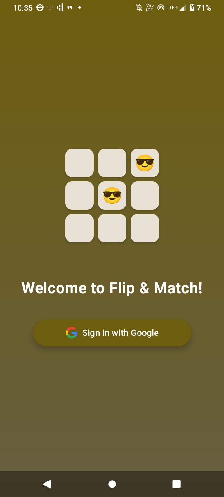
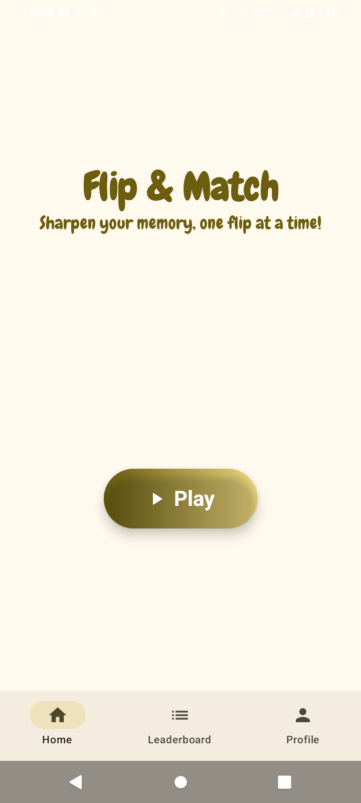
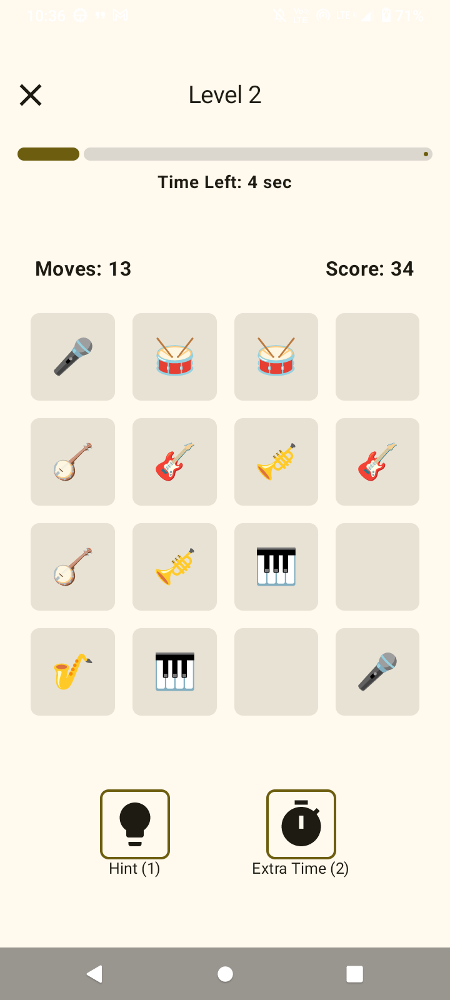
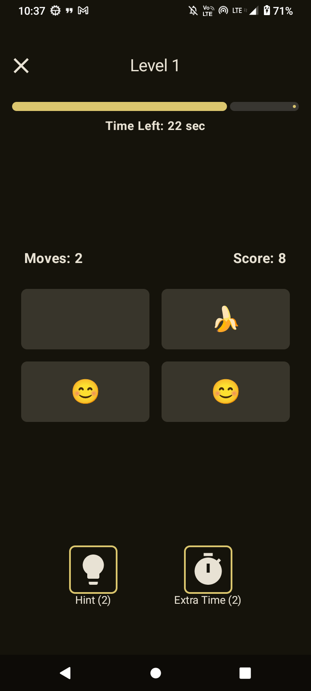
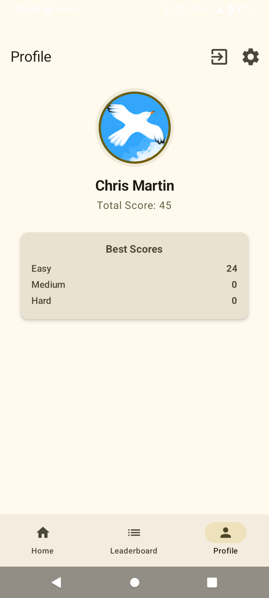
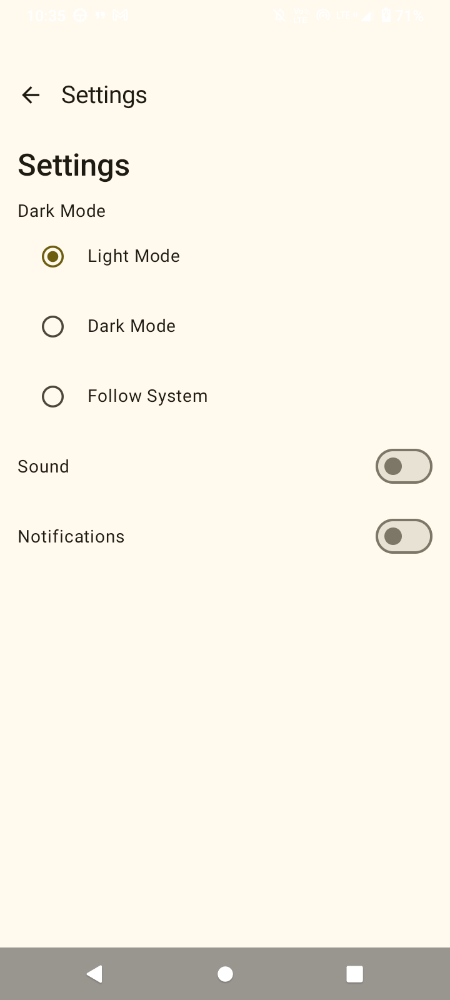

# Flip & Match 🎴  

A fun and engaging memory puzzle game where players flip cards to find matching pairs!  

## 📌 Features  
- 🧠 **Memory Challenge:** Train your brain by matching identical cards.   
- 🔢 **Multiple Difficulties:** Choose from different grid sizes for more challenge.  
- 🖼️ **Emoji & Image Cards:** Play with a variety of themes.  
- 📊 **Score Tracking:** Keep track of your best scores and progress.

## 🛠️ Tech Stack
- Kotlin - Language used
- Jetpack Compose - UI Framework
- Hilt - Dependency Injection
- ViewModel & Flow - State Management
- Firestore - storing user data
- Authentication - Google sign in

## 🖼️ Screenshots  
      
      

## 🚀 How to Play  
1. Tap on a card to flip it.  
2. Find its matching pair by flipping another card.  
3. Match all pairs to win the game.  
4. Complete puzzles as quickly as possible for a higher score!  

